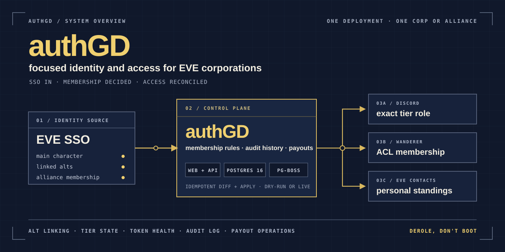

# authGD — focused identity and access for EVE corporations and alliances

<p align="center">
  <a href="https://github.com/guarzo/authGD/actions/workflows/ci.yml"></a>
  <a href="LICENSE"></a>
  <a href="package.json"></a>
</p>

<p align="center">
  
</p>

authGD is a focused, self-hosted identity and access manager for one EVE Online
corporation or alliance. Members sign in with EVE SSO, link their characters,
and keep Discord roles, Wanderer ACL access, and in-game standings synchronized
from one account.

It is an opinionated alternative to a full Alliance Auth deployment for a group
that wants this exact workflow and nothing else. It is not a multi-tenant
community platform, not a plugin framework, and not a general-purpose EVE
dashboard.

> [!IMPORTANT]
> **One deployment serves one corporation or alliance.** It has a single
> `ALLIANCE_ID`, a single Discord guild, a single Wanderer ACL, and a single
> standings label. There is no multi-tenancy — running it for two groups means
> running it twice. EVE SSO, Discord, Wanderer, and in-game standings are all
> required today; none can currently be switched off.

## What authGD manages

| Area | What it does |
| --- | --- |
| **Identity** | EVE SSO login, a main character, auto-approved alt linking, ESI refresh tokens encrypted at rest, token-health tracking, and server-side sessions. |
| **Membership** | Pending, Member, Associate, and Alumni tiers driven by the main character's alliance, with manual admin tier locks and cryo/AFK state. |
| **Access reconciliation** | Exactly one Discord tier role, Wanderer ACL membership, and personal in-game standings under a contact label the app owns. |
| **Payout operations** | Fight-operation records, loot appraisal, roster and participant pools, a configurable corporation share, per-participant shares, and payment tracking. |
| **Operations** | Audit log with actor and cause, admin sync status, health endpoints, on-demand and retrying background jobs, and a dry-run mode. |

### Why a focused system

- **Derole, don't boot.** Leaving members drop to a lower tier but keep their
  account, linked characters, ESI tokens, and Discord link, so returning is
  frictionless.
- **Desired state, not one-shot scripts.** Every sync job compares what should
  exist against what does exist and applies only the difference, so re-running
  one is always safe.
- **One database.** Postgres holds application data *and* the pg-boss job queue.
  There is no Redis to operate.
- **No Discord gateway process.** Role changes go over the Discord REST API with
  a bot token — no gateway connection, no separate bot service.
- **Dry-run first.** A new deployment can log every intended EVE, Discord, and
  Wanderer change before it is allowed to write anything.

The trade-off is real: the smaller scope is what keeps authGD reviewable, and it
is also why it will not cover everything a larger organization needs.

## Is authGD a good fit?

| Good fit | Look elsewhere when you need |
| --- | --- |
| One corporation or alliance running its own deployment | Multiple unrelated groups in one deployment |
| EVE SSO, Discord, Wanderer, and standings as one fixed workflow | Integrations you can enable and disable independently |
| A small, reviewable TypeScript application | A plugin ecosystem or broad service provisioning |
| Automatic membership and access reconciliation | A general EVE community portal, asset tracker, or intel platform |
| Self-hosting a web process, a worker, and Postgres | Compatibility with your existing Alliance Auth plugins |

## Membership tiers

| Tier | How it is set | Standings | Wanderer map | Discord role |
| --- | --- | --- | --- | --- |
| **Pending** | every new account, until membership is confirmed or an admin decides | none | no | none |
| **Member** | automatic: main character in the configured alliance | `STANDINGS_VALUE` (+5 by default) on linked characters | yes | Member |
| **Associate** | manual (admin); locks the tier | none | no | Associate |
| **Alumni** | automatic when a Member's main leaves the alliance | none | no | Alumni |

Membership is tested against the account's **main** character's alliance. Tiers
are system-managed by default; any manual tier an admin sets locks the account so
the membership job leaves it alone, and admins can "return to auto" to unlock it.
An Alumni account whose main rejoins the alliance is restored to Member
automatically.

Pending grants nothing on purpose — no standings, no map, no Discord role — and
the membership job never converges an unreviewed Pending account to Alumni on its
own, so an account nobody has ruled on cannot drift into an automatic grant.

The four names above are the internal enum values. What your users see is set by
`TIER_LABEL_MEMBER`, `TIER_LABEL_ASSOCIATE`, `TIER_LABEL_ALUMNI` and
`TIER_LABEL_PENDING` — see [Making it yours](#making-it-yours).

## Payout operations

Payouts are an operations feature built on the same accounts, not a separate
application. An operator records a fight operation, pastes a roster and a loot
list, appraises the loot, and splits the proceeds: the corp takes the share
stamped on the operation, and the remainder divides across participants by share
count, with individual participants adjustable or excluded. Payments are recorded
per participant, and an operation locks once money has moved.

Reading payouts requires tier `member` — any status, so a cryo account still sees
the history. Creating and editing them requires an **active** member account,
which is what keeps someone who has stepped away from moving alliance ISK.

## Architecture

One repository, one built image, two process groups (`web` and `worker`), plus
Postgres. On Fly.io those are two process groups off the same image; locally they
are two commands in two terminals.

```text
member / admin
      │
      ▼
web (Next.js UI + API) ──enqueue──▶ worker (pg-boss jobs)
      │                                  │
      ├── EVE SSO + Discord OAuth        ├── ESI
      ├── account + admin UI             ├── Discord REST
      ├── audit + payout operations      └── Wanderer API
      │                                  │
      └──────────────────▶ Postgres ◀────┘
                       data + job queue
```

- **web** — Next.js 16 App Router. Member pages (login, account, add character,
  link Discord, payouts) and admin pages (accounts, audit log, sync status).
  OAuth callbacks live in API routes. Web never calls an external service inside
  a request: it writes its state change and enqueues a job.
- **worker** — the same codebase running [pg-boss](https://github.com/timgit/pg-boss):
  scheduled and on-demand jobs with exponential-backoff retries. No Redis.
- **Postgres 16** — application data, audit history, sessions, *and* the job queue.
- **Integrations are outbound REST only.** Discord role changes go over the REST
  API with a bot token — no gateway connection, no bot process. Wanderer uses the
  ACL API key.

Sync jobs are all idempotent diff-and-apply, so re-running them is always safe:
membership verification (every 30 min, the anchor), contact push (hourly and on
demand), Wanderer ACL sync (hourly and on demand), Discord role sync (hourly and
on demand), token health (daily), a weekly affiliation recheck, and a daily
purge. The admin sync page renders each job's cadence from the same table the
worker schedules from, so the two cannot drift.

Stack: TypeScript (strict), Next.js 16, React 19, Drizzle ORM, pg-boss, `jose` +
native `fetch` for OAuth, Vitest, and Playwright. Sessions are server-side — an
opaque id in an HTTP-only cookie backed by a `session` row — so revoking one is a
row delete that takes effect on the next request.

## Quickstart (local development)

Requires Node.js 24+ and Docker.

```bash
# 1. Start Postgres 16 (published on host port 5433 to stay out of a local 5432's way)
docker compose -f docker-compose.dev.yml up -d

# 2. Install dependencies
npm install

# 3. Configure — the example is a complete set of working fakes and needs
#    no editing to get a browsable app.
cp .env.example .env

# 4. Run migrations
npm run db:migrate

# 5. Start the web app  →  http://localhost:3000
npm run dev
```

In a second terminal, start the job worker:

```bash
npm run worker
```

Run the test suites (both need the dev Postgres from step 1 running):

```bash
npm test
npm run test:e2e
```

`.env.example` ships `SYNC_MODE=dry-run`, so the sync jobs cannot change anything
in EVE, Discord, or Wanderer. On the fake values the app itself, the migrations,
and both test suites work. The Wanderer, Discord-roles, and contacts sync jobs
are **expected to fail or skip** — the fake hosts and tokens are not real, and
that is what a correctly-configured dev worker looks like. EVE SSO login and
Discord linking need real credentials.

**[`docs/ops.md` → Local development](docs/ops.md#local-development) is the
canonical guide** — why `npm test` cannot touch your dev database, what works on
fakes and what does not, running tests alongside another checkout, and the
tunnelled-OAuth setup.

Other useful scripts: `npm run build`, `npm run typecheck`, `npm run lint`,
`npm run format:check`, `npm run test:watch`, and `npm run db:generate` to author
a new migration after changing the Drizzle schema.

## Running it for your corp

The quickstart above runs on fake credentials. To point a deployment at your own
corp you need accounts on four external services. Every value below goes in
`.env` (or your host's secret store); [`docs/ops.md` → Environment
variables](docs/ops.md#environment-variables) is the authoritative
variable-by-variable reference and deployment runbook, and this section is how
you obtain each one.

**1. A Postgres 16 database.** `DATABASE_URL`. `npm run db:migrate` creates the
schema; the same database also backs the pg-boss job queue, so no Redis.

**2. Your public URL.** `APP_BASE_URL` — the deployment's public URL. authGD
normalizes it to origin plus path and strips any trailing slash before
constructing OAuth callbacks.

**3. A token encryption key.** ESI refresh tokens are encrypted at rest with it:

```bash
openssl rand -base64 32   # → TOKEN_ENCRYPTION_KEY
```

Losing or rotating this key invalidates every stored token, and every member has
to re-add their characters. Back it up with your other secrets.

**4. An EVE SSO application** — register at
[developers.eveonline.com](https://developers.eveonline.com/applications). Set the
callback URL to `<APP_BASE_URL>/auth/eve/callback` and request the scopes you put
in `EVE_SSO_SCOPES` (contact writing is what standings distribution needs). That
gives you `EVE_SSO_CLIENT_ID` and `EVE_SSO_CLIENT_SECRET`. `ESI_CONTACT` is the
email CCP contacts if your deployment misbehaves; it is sent on every ESI
request.

Then set `ALLIANCE_ID` to the alliance whose members get the Member tier, and
`BOOTSTRAP_ADMIN_CHARACTER_IDS` to the character IDs who should be admins on
first login — otherwise nobody can reach the admin pages.

**5. A Discord application and bot** — [Developer
Portal](https://discord.com/developers/applications). You need:

- `DISCORD_CLIENT_ID` / `DISCORD_CLIENT_SECRET`, with
  `<APP_BASE_URL>/auth/discord/callback` added as a redirect, for member account
  linking.
- `DISCORD_BOT_TOKEN` for the bot that assigns roles. Invite it to your guild
  (`DISCORD_GUILD_ID`) with **Manage Roles**, and make sure its own role sits
  **above** all three managed roles in the guild's role list — Discord refuses to
  assign a role at or above the bot's own.
- Three roles, one per tier: `DISCORD_ROLE_ID_MEMBER`,
  `DISCORD_ROLE_ID_ASSOCIATE`, `DISCORD_ROLE_ID_ALUMNI`. They must be **three
  distinct ids** — the sync grants exactly one and removes the other two, so
  pointing two variables at the same role means the sync fights itself.
- Optionally `DISCORD_OPS_WEBHOOK_URL` for sync failure notifications.

**6. A Wanderer map ACL.** `WANDERER_BASE_URL`, `WANDERER_ACL_ID`, and
`WANDERER_API_KEY` — **the ACL's own API key, not the map's**. Both are bare
UUIDs and look identical; the map key returns 401 against `/api/acls/*`.

**7. Standings.** `STANDINGS_VALUE` is the standing to set (+5 for members) and
`STANDINGS_LABEL` is the in-game contact label the app **owns**. It deletes
contacts under that label that no longer belong, so give it a label nothing else
uses. Matching ignores capitalization and surrounding whitespace, so a label
named `AuthGD` is claimed by a configured `authgd` too — but when two labels are
both fold-equal and neither matches exactly, authGD refuses to guess rather than
picking one.

Finally, `SYNC_MODE` is required and has no default. `dry-run` logs what each job
*would* do and touches nothing external; `live` actually writes to EVE, Discord,
and Wanderer. Bring a new deployment up in `dry-run`, read the logs, and switch
to `live` when the diffs look right.

## Making it yours

Nothing corp-specific is compiled in. The display name, tagline, tier labels, and
login-page copy are all environment variables — every one optional, each falling
back to a neutral default:

| Variable                                                    | Where it shows                               | Default                                       |
| ----------------------------------------------------------- | -------------------------------------------- | --------------------------------------------- |
| `BRAND_NAME`                                                | header wordmark, page titles, image alt text | `authGD`                                      |
| `BRAND_TAGLINE`                                             | the smaller line beneath the wordmark        | `Auth`                                        |
| `BRAND_MOTTO`                                               | login page only; `\n` splits it across lines | empty (renders nothing)                       |
| `BRAND_FOOTER`                                              | login page footer                            | empty (renders nothing)                       |
| `BRAND_MARK_URL`                                            | the small header mark                        | `/brand/mark.webp`                            |
| `BRAND_SEAL_URL`                                            | the large login-page emblem                  | `/brand/emblem.webp`                          |
| `TIER_LABEL_MEMBER` / `_ASSOCIATE` / `_ALUMNI` / `_PENDING` | every place a tier name is rendered          | `Member` / `Associate` / `Alumni` / `Pending` |

The tier labels are display-only: the database enum, the audit log, and the API
keep the internal names, so relabelling is safe at any time and changes nothing
persisted.

One knob is policy rather than display: `PAYOUT_CORP_SHARE_PCT` (default `10`)
sets the corp's cut of a payout. Unlike the labels above it is *not* display-only
— it is stamped onto each operation when the operation is created, so changing it
affects new payouts and deliberately leaves finished ones showing the rate they
were actually paid at. See `docs/ops.md` for the full note.

Four reference-deployment images live in `public/brand/`. Two are reachable by
config — point `BRAND_MARK_URL` and `BRAND_SEAL_URL` anywhere you like, including
an external URL. The other two are referenced by path and can only be changed by
replacing the file:

| File                             | Where it shows            | Configurable           |
| -------------------------------- | ------------------------- | ---------------------- |
| `public/brand/mark.webp`         | header mark               | yes — `BRAND_MARK_URL` |
| `public/brand/emblem.webp`       | login page emblem         | yes — `BRAND_SEAL_URL` |
| `public/brand/hero.webp`         | login page background     | no — replace the file  |
| `public/brand/hero-account.webp` | account page illustration | no — replace the file  |

Those four are Faoble's artwork and are **not** MIT licensed. You may keep them —
see [Artwork license](ARTWORK-LICENSE.md), which comes down to crediting the
artist — or replace them. The architecture diagram under `docs/assets/` is
repository documentation and is MIT licensed like the code.

`PRODUCT.md` and `DESIGN.md` describe the reference deployment's own voice and
visual language. They are a design record, not a template: if you are actively
developing a fork, rewrite them for your corp rather than treating their
personality choices as requirements.

## Documentation

- [Contributing](CONTRIBUTING.md) — setup, the checks CI runs, and the handful of
  rules that keep a live deployment's data safe.
- [Operations guide](docs/ops.md) — deployment, the Fly.io runbook, monitoring,
  and the full environment-variable reference.
- [Product record](PRODUCT.md) and [Design record](DESIGN.md) — the reference
  deployment's intended users, voice, visual system, and accessibility decisions.

The tier model, data model, sync jobs, and auth flows are documented in the code
itself: `src/db/schema.ts` for the data model, `src/core/` for the tier and diff
rules, `src/jobs/` and `src/worker/` for the sync jobs, and `src/app/auth/` for
the OAuth flows.

## FAQ

**Is authGD multi-tenant?** No. One deployment, one alliance, one Discord guild,
one Wanderer ACL, one standings label.

**Is it a drop-in Alliance Auth replacement?** No. It covers one fixed workflow
and has no plugin ecosystem, so existing Alliance Auth plugins have nothing to
attach to.

**Can integrations be disabled?** Not today. EVE SSO, Discord, Wanderer, and
standings are all required.

**Does it manage Discord roles?** Yes — it grants exactly the one role matching
an account's tier and removes the other two, over the REST API.

**Does it delete accounts when members leave?** No. Derole, don't boot: they drop
a tier and keep the account, characters, tokens, and Discord link.

**Does it include payouts?** Yes — fight operations, loot appraisal, participant
shares, a corp cut, and payment tracking.

**Does it need Redis?** No. Postgres backs both the data and the job queue.

**Can it run without touching anything?** Yes. `SYNC_MODE=dry-run` logs every
intended change and writes to no external service.

## Status

The reference deployment is in production and the repository is under active
development. authGD is intentionally opinionated; the public project does not yet
promise a stable plugin, configuration, or multi-tenant compatibility surface.

## License

[MIT](LICENSE) for the source code and for the repository's own documentation
graphics under `docs/assets/`.

Faoble's reference-deployment artwork under `public/brand/` has separate terms in
[ARTWORK-LICENSE.md](ARTWORK-LICENSE.md). Keep the artist credit if you keep those
files; replace them if you want an entirely independent visual identity.

EVE Online and all related logos and images are trademarks or registered
trademarks of CCP hf. authGD is a third-party tool, not affiliated with or
endorsed by CCP hf. See [NOTICE.md](NOTICE.md) for the full notice.
