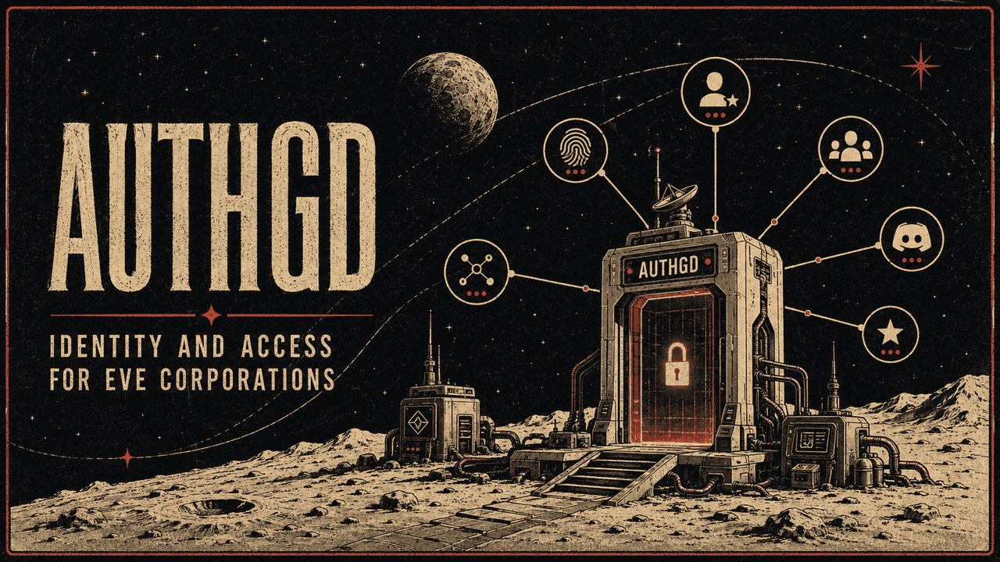

# authGD

<p align="center">
  
</p>

A modern, minimal replacement for the Alliance Auth stack, built for a small EVE Online corporation.
It does only what a corp actually uses — no plugin ecosystem, no admin sprawl.

**Who it is for:** one corporation or alliance, self-hosting one deployment for
itself. There is no multi-tenancy — a deployment has a single `ALLIANCE_ID`, a
single Discord guild, and a single Wanderer ACL. Running it for two groups means
running it twice. All four integrations (EVE SSO, Discord, Wanderer, in-game
standings) are mandatory; none can currently be switched off.

- **EVE SSO login** — the first character login creates the account and becomes the
  main. Every character login requests the full configured scope set, so nobody ever
  has to re-add a character just to grant another scope.
- **Alt linking** — link as many alts as you like from the account page; auto-approved
  and audit-logged. Alts may sit in any corp or alliance.
- **Automatic standings distribution** — pushes the member roster into each member
  character's in-game personal contacts at +5, scoped to a configured contact label.
- **Wanderer map ACL management** — keeps the map ACL in sync with the member roster.
- **Discord role management** — grants exactly the one role matching an account's tier.
- **Derole, don't boot** — leaving members drop to a lower tier but keep their account,
  linked characters, ESI tokens, and Discord link, so returning is frictionless.
- **Audit log** — every tier change, link, and sync action is recorded with actor and cause.
- **Admin accounts page** — one row per account with tier controls, cryo/AFK tracking
  with dates and notes, token health, Discord and map state, sortable and filterable.

## Membership tiers

| Tier          | How it is set                         | Standings              | Wanderer map | Discord role |
| ------------- | ------------------------------------- | ---------------------- | ------------ | ------------ |
| **Member**    | automatic: main character in alliance | +5 on all linked chars | yes          | Member       |
| **Associate** | manual (admin); locks the tier        | none                   | no           | Associate    |
| **Alumni**    | automatic on leaving the alliance     | none                   | no           | Alumni       |

Membership is tested against the account's **main** character's alliance. Tiers are
system-managed by default; any manual tier an admin sets locks the account so the
membership job leaves it alone, and admins can "return to auto" to unlock it. An
Alumni account whose main rejoins the alliance is restored to Member automatically.

There is a fourth tier, **Pending**: every new account starts here, and stays
until a confirmed alliance main promotes it to Member or an admin approves it as
Associate or Alumni. It grants nothing — no standings, no map, no Discord role —
and the membership job never converges it to Alumni on its own, so an account
nobody has ruled on cannot drift into an automatic grant.

The four names above are the internal enum values. What your users see is set by
`TIER_LABEL_MEMBER`, `TIER_LABEL_ASSOCIATE`, `TIER_LABEL_ALUMNI` and
`TIER_LABEL_PENDING` — see [Making it yours](#making-it-yours).

## Architecture

One repo, one image, two containers, plus Postgres.

```text
web (Next.js UI + API)  ──enqueue──▶  worker (pg-boss jobs)  ──▶  Postgres (data + queue)
        │                                    │
  EVE SSO, Discord OAuth          ESI · Wanderer API · Discord REST
```

- **web** — Next.js 16 App Router. Member pages (login, account, add character, link
  Discord) and admin pages (accounts, audit log, sync status). OAuth callbacks live in
  API routes. Web enqueues on-demand sync jobs.
- **worker** — the same codebase running [pg-boss](https://github.com/timgit/pg-boss):
  scheduled and on-demand jobs with exponential-backoff retries. No Redis.
- **Postgres 16** — application data *and* the job queue.
- **Integrations are outbound REST only.** Discord role changes go over the REST API with
  a bot token — no gateway connection, no bot process. Wanderer uses the map API key.

Sync jobs are all idempotent diff-and-apply, so re-running them is always safe:
membership verification (every 30 min, the anchor), contact push (hourly + on demand),
Wanderer ACL sync (hourly + on demand), Discord role sync (hourly + on demand), and
token health (daily).

Stack: TypeScript (strict), Drizzle ORM, `jose` + `fetch` for OAuth, Vitest.
Sessions are server-side — an opaque id in an HTTP-only cookie backed by a `session`
row — so revoking one is a row delete that takes effect on the next request.

## Quickstart (local development)

Requires Node.js 24+ and Docker.

```bash
# 1. Start Postgres 16 (published on host port 5433 to stay out of a local 5432's way)
docker compose -f docker-compose.dev.yml up -d

# 2. Install dependencies
npm install

# 3. Configure — the example is a complete set of working fakes and needs
#    no editing to get a browsable app.
cp .env.example .env

# 4. Run migrations
npm run db:migrate

# 5. Start the web app  →  http://localhost:3000
npm run dev
```

In a second terminal, start the job worker:

```bash
npm run worker
```

Run the test suite (needs the dev Postgres from step 1 running):

```bash
npm test
```

`.env.example` ships `SYNC_MODE=dry-run`, so the sync jobs cannot change anything
in EVE, Discord, or Wanderer. On the fake values the app itself, the migrations,
and both test suites work. The Wanderer, Discord-roles, and contacts sync jobs
are **expected to fail or skip** — the fake hosts and tokens are not real, and
that is what a correctly-configured dev worker looks like. EVE SSO login and
Discord linking need real credentials.

**[`docs/ops.md` → Local development](docs/ops.md#local-development) is the
canonical guide** — why `npm test` cannot touch your dev database, what works on
fakes and what does not, running tests alongside another checkout, and the
tunnelled-OAuth setup.

Other useful scripts: `npm run build`, `npm run typecheck`, `npm run lint`,
`npm run test:watch`, and `npm run db:generate` to author a new migration after
changing the Drizzle schema.

## Running it for your corp

The quickstart above runs on fake credentials. To point a deployment at your own
corp you need accounts on four external services. Every value below goes in
`.env` (or your host's secret store); [`docs/ops.md` → Environment
variables](docs/ops.md#environment-variables) is the authoritative
variable-by-variable reference, and this section is how you obtain each one.

**1. A Postgres 16 database.** `DATABASE_URL`. `npm run db:migrate` creates the
schema; the same database also backs the pg-boss job queue, so no Redis.

**2. Your public URL.** `APP_BASE_URL`, with **no trailing slash** — it is
string-concatenated into the OAuth callback URLs, and a stray `/` produces a
redirect URI the providers will reject.

**3. A token encryption key.** ESI refresh tokens are encrypted at rest with it:

```bash
openssl rand -base64 32   # → TOKEN_ENCRYPTION_KEY
```

Losing or rotating this key invalidates every stored token, and every member has
to re-add their characters. Back it up with your other secrets.

**4. An EVE SSO application** — register at
[developers.eveonline.com](https://developers.eveonline.com/applications). Set the
callback URL to `<APP_BASE_URL>/auth/eve/callback` and request the scopes you put
in `EVE_SSO_SCOPES` (contact writing is what standings distribution needs). That
gives you `EVE_SSO_CLIENT_ID` and `EVE_SSO_CLIENT_SECRET`. `ESI_CONTACT` is the
email CCP contacts if your deployment misbehaves; it is sent on every ESI
request.

Then set `ALLIANCE_ID` to the alliance whose members get the Member tier, and
`BOOTSTRAP_ADMIN_CHARACTER_IDS` to the character IDs who should be admins on
first login — otherwise nobody can reach the admin pages.

**5. A Discord application and bot** — [Developer
Portal](https://discord.com/developers/applications). You need:

- `DISCORD_CLIENT_ID` / `DISCORD_CLIENT_SECRET`, with
  `<APP_BASE_URL>/auth/discord/callback` added as a redirect, for member account
  linking.
- `DISCORD_BOT_TOKEN` for the bot that assigns roles. Invite it to your guild
  (`DISCORD_GUILD_ID`) with **Manage Roles**, and make sure its own role sits
  **above** all three managed roles in the guild's role list — Discord refuses to
  assign a role at or above the bot's own.
- Three roles, one per tier: `DISCORD_ROLE_ID_MEMBER`,
  `DISCORD_ROLE_ID_ASSOCIATE`, `DISCORD_ROLE_ID_ALUMNI`. They must be **three
  distinct ids** — the sync grants exactly one and removes the other two, so
  pointing two variables at the same role means the sync fights itself.
- Optionally `DISCORD_OPS_WEBHOOK_URL` for sync failure notifications.

**6. A Wanderer map ACL.** `WANDERER_BASE_URL`, `WANDERER_ACL_ID`, and
`WANDERER_API_KEY` — **the ACL's own API key, not the map's**. Both are bare
UUIDs and look identical; the map key returns 401 against `/api/acls/*`.

**7. Standings.** `STANDINGS_VALUE` is the standing to set (+5 for members) and
`STANDINGS_LABEL` is the in-game contact label the app **owns**. It deletes
contacts under that label that no longer belong, so give it a label nothing else
uses. Matching ignores capitalization and surrounding whitespace,
so a label named `AuthGD` is claimed by a configured `authgd` too.

Finally, `SYNC_MODE` is required and has no default. `dry-run` logs what each job
*would* do and touches nothing external; `live` actually writes to EVE, Discord,
and Wanderer. Bring a new deployment up in `dry-run`, read the logs, and switch
to `live` when the diffs look right.

## Making it yours

Nothing corp-specific is compiled in. The display name, tagline, tier labels, and
login-page copy are all environment variables — every one optional, each falling
back to a neutral default:

| Variable                                                    | Where it shows                               | Default                                       |
| ----------------------------------------------------------- | -------------------------------------------- | --------------------------------------------- |
| `BRAND_NAME`                                                | header wordmark, page titles, image alt text | `authGD`                                      |
| `BRAND_TAGLINE`                                             | the smaller line beneath the wordmark        | `Auth`                                        |
| `BRAND_MOTTO`                                               | login page only; `\n` splits it across lines | empty (renders nothing)                       |
| `BRAND_FOOTER`                                              | login page footer                            | empty (renders nothing)                       |
| `BRAND_MARK_URL`                                            | the small header mark                        | `/brand/mark.webp`                            |
| `BRAND_SEAL_URL`                                            | the large login-page emblem                  | `/brand/emblem.webp`                          |
| `TIER_LABEL_MEMBER` / `_ASSOCIATE` / `_ALUMNI` / `_PENDING` | every place a tier name is rendered          | `Member` / `Associate` / `Alumni` / `Pending` |

The tier labels are display-only: the database enum, the audit log, and the API
keep the internal names, so relabelling is safe at any time and changes nothing
persisted.

One knob is policy rather than display: `PAYOUT_CORP_SHARE_PCT` (default `10`)
sets the corp's cut of a payout. Unlike the labels above it is *not* display-only
— it is stamped onto each operation when the operation is created, so changing it
affects new payouts and deliberately leaves finished ones showing the rate they
were actually paid at. See `docs/ops.md` for the full note.

Four images live in `public/brand/`. Two are reachable by config — point
`BRAND_MARK_URL` and `BRAND_SEAL_URL` anywhere you like, including an external
URL. The other two are referenced by path and can only be changed by replacing
the file:

| File                             | Where it shows            | Configurable           |
| -------------------------------- | ------------------------- | ---------------------- |
| `public/brand/mark.webp`         | header mark               | yes — `BRAND_MARK_URL` |
| `public/brand/emblem.webp`       | login page emblem         | yes — `BRAND_SEAL_URL` |
| `public/brand/hero.webp`         | login page background     | no — replace the file  |
| `public/brand/hero-account.webp` | account page illustration | no — replace the file  |

The shipped images are the reference deployment's artwork. They are **not** MIT
licensed but you may keep them — see [License](#license) for the terms, which
come down to crediting the artist.

`PRODUCT.md` and `DESIGN.md` describe the reference deployment's own voice and
visual language. They are a design record, not a template: if you are actively
developing a fork, rewrite them for your corp rather than treating their
personality choices as requirements.

## Documentation

- [Contributing](CONTRIBUTING.md) — setup, the checks CI runs, and the handful of
  rules that keep a live deployment's data safe.
- [Operations guide](docs/ops.md) — deployment, the Fly.io runbook, and the full
  environment-variable reference.

The tier model, data model, sync jobs, and auth flows are documented in the code
itself: `src/db/schema.ts` for the data model, `src/core/` for the tier and diff
rules, `src/jobs/` and `src/worker/` for the sync jobs, and `src/app/auth/` for
the OAuth flows.

## Status

Built in phases: foundation and auth, then the sync engine, then the admin UI and ops
tooling. All three are in production.

## License

[MIT](LICENSE) for the source code.

The artwork in `docs/assets/` and `public/` is **not** covered by the MIT
license. It was created by **Faoble**, who permits it to be used and
redistributed — including in a fork or your own deployment — **as long as Faoble
is credited**. All other rights remain with the artist. You are welcome to keep
the images or replace them; if you keep them, carry the credit.

EVE Online and all related logos and images are trademarks or registered trademarks
of CCP hf. authGD is a third-party tool, not affiliated with or endorsed by CCP hf.
See [LICENSE](LICENSE) for the full notice.

